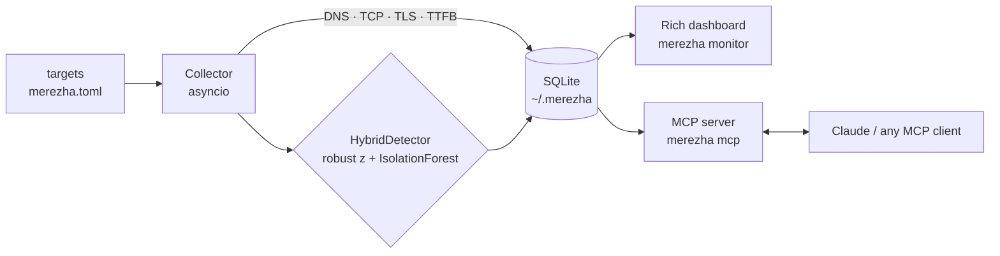

# merezha

[](https://github.com/illiatkachuk/merezha/actions/workflows/ci.yml)


**AI-native network observability in your terminal.** Async latency probes, hybrid ML anomaly
detection, a live dashboard — and an [MCP](https://modelcontextprotocol.io) server so AI
assistants like Claude can diagnose your network for you.

*"Merezha" (мережа) means "network" in Ukrainian.*

---

## Why this exists

I study telecommunications engineering, and the first thing you learn in that field is that
**"the internet is slow" is never one problem**. It could be DNS. It could be the TCP handshake.
It could be the TLS negotiation, or the server itself taking forever to produce the first byte.
`ping` can't tell you which — it just gives you one blurry number.

Most monitoring stacks that *can* tell you (Prometheus + Grafana + exporters + alert rules) are
heavy infrastructure for answering a simple question: **"is my network okay right now, and if
not, what exactly broke?"**

`merezha` is my answer as both a network engineer and a Python developer:

- **It decomposes every check into a waterfall** — DNS → TCP → TLS → TTFB — like `curl -w`,
  but continuous, stored, and analyzed.
- **It learns what "normal" looks like** for each target and flags anomalies using a hybrid
  of robust statistics and machine learning — no thresholds to configure.
- **It speaks MCP**, so instead of reading dashboards you can just ask Claude:
  *"why was my connection bad last night?"* — and it will query the actual measurement data.

No accounts. No cloud. No API keys. One SQLite file in `~/.merezha`.

## Features

- **Phase-level latency waterfall** — separate DNS, TCP connect, TLS handshake and TTFB timings
  for every probe, built on raw `asyncio` (no HTTP client libraries).
- **Hybrid anomaly detection** — robust z-score (median + MAD) works from the first minutes;
  an `IsolationForest` joins in once enough history exists. Agreement logic keeps false
  positives low. Failures are always flagged.
- **Live terminal dashboard** — per-target status, rolling averages, p95, packet loss and
  Unicode sparkline trends, rendered with [Rich](https://github.com/Textualize/rich).
- **MCP server** — four tools (`check_host`, `network_status`, `latency_history`,
  `recent_anomalies`) that let any MCP client (e.g. Claude Desktop) run live checks and read
  your measurement history.
- **Zero-config storage** — plain SQLite, append-only, with indexes. Your data never leaves
  your machine.
- **Typed, tested, linted** — `mypy`-friendly type hints, `pytest` suite that spins up real
  local sockets (no mocks of `asyncio` internals), `ruff` in CI.

## Demo

One-shot diagnostic of a host:

```text
$ merezha check github.com

  github.com:443 — 142.3 ms total

  dns   ▇▇▇▇▇                       18.2 ms
  tcp   ▇▇▇▇▇▇▇▇                    31.7 ms
  tls   ▇▇▇▇▇▇▇▇▇▇▇▇▇▇▇            58.9 ms
  ttfb  ▇▇▇▇▇▇▇▇▇                   33.5 ms
```

Continuous monitoring with the live dashboard:

```text
$ merezha monitor

 merezha — network observability                    round 47 · 3 targets

 target            host          status   last      avg 1h   p95 1h  loss 1h  trend      detector
 ─────────────────────────────────────────────────────────────────────────────────────────────────
 google            google.com    ● up     24.1 ms   23.8 ms  31 ms   0.0%     ▃▃▄▃▃▅▃▃   ok
 cloudflare-dns    1.1.1.1       ● up      8.4 ms    8.9 ms  12 ms   0.0%     ▂▂▂▃▂▂▂▂   ok
 github            github.com    ● up     61.0 ms   45.2 ms  89 ms   1.2%     ▃▃▃▃█▆▄▃   ⚠ anomaly

 recent anomalies
 ─────────────────────────────────────────────────────────────────────────────────────────────────
 14:32:07  github  latency 156.0 ms (z=4.8, hybrid)
```

> Tip: record a GIF of `merezha monitor` with [vhs](https://github.com/charmbracelet/vhs) or
> [asciinema](https://asciinema.org) and drop it here — it looks great in motion.

## Quickstart

Requires Python 3.11+.

```bash
pip install git+https://github.com/illiatkachuk/merezha.git

merezha check github.com        # one-shot waterfall diagnostic
merezha init                    # write merezha.toml with default targets
merezha monitor                 # live dashboard (Ctrl+C to stop)
merezha history github          # stats + recent samples for a target
merezha anomalies --hours 24    # what went wrong lately
```

Or from a clone:

```bash
git clone https://github.com/illiatkachuk/merezha.git
cd merezha
pip install -e ".[dev,mcp]"
pytest -q
```

Targets live in `merezha.toml`:

```toml
interval = 10.0   # seconds between rounds
timeout  = 5.0

[[targets]]
name = "google"
host = "google.com"
port = 443
kind = "http"     # full waterfall: dns + tcp + tls + ttfb

[[targets]]
name = "cloudflare-dns"
host = "1.1.1.1"
port = 53
kind = "tcp"      # dns + tcp connect only
```

## Use it from Claude (MCP)

`merezha` ships an [MCP](https://modelcontextprotocol.io) server over stdio. Install the extra
and register it in Claude Desktop:

```bash
pip install "merezha[mcp]"
```

```json
{
  "mcpServers": {
    "merezha": {
      "command": "merezha",
      "args": ["mcp"]
    }
  }
}
```

Then ask things like:

- *"Check if github.com is reachable and break down the latency."*
- *"What does my network look like right now?"*
- *"Were there any anomalies in the last 12 hours? What kind?"*

Claude calls the tools, reads real measurements from your local SQLite database, and reasons
over them. The server never sends your data anywhere — the AI client comes to *it*.

| Tool | What it does |
|---|---|
| `check_host` | Live waterfall probe of any host (DNS/TCP/TLS/TTFB) |
| `network_status` | Current status + 1h stats for all monitored targets |
| `latency_history` | Recent samples for one target over N hours |
| `recent_anomalies` | Detected anomalies with z-scores and methods |

## How the anomaly detection works

Fixed thresholds ("alert if > 100 ms") are wrong on every network except the one they were
tuned on. `merezha` learns each target's behaviour instead, with a two-layer hybrid:

1. **Robust z-score (median + MAD)** — active almost immediately (after an 8-sample warm-up).
   Median and MAD are used instead of mean/stddev because latency spikes would otherwise
   poison the baseline they're being compared against. A sample is anomalous on this layer
   alone if `|z| ≥ 3.5`.
2. **IsolationForest** (scikit-learn) — trains once 120+ samples exist and retrains every 50.
   Features: latency, jitter (delta from previous sample), and the hour of day encoded as
   `sin/cos` so the model can learn daily patterns (your ISP at 8 PM ≠ your ISP at 4 AM).
3. **Agreement rule** — once the forest is active, it can only *escalate*: a sample is flagged
   if the z-score alone is extreme, **or** the forest votes anomaly **and** the z-score is at
   least moderately elevated. This keeps false positives low without hiding real events.
   Probe failures (timeouts, refused connections) are always anomalies.

The detector keeps a rolling window per target, excludes the candidate sample from its own
baseline, and stores every verdict (score, method) alongside the measurement — so you can
audit *why* something was flagged.

## Architecture



Every component is importable and testable on its own — the CLI is a thin layer over the
library (`merezha.probes`, `merezha.anomaly`, `merezha.storage`, `merezha.collector`).

## Project layout

```
src/merezha/
├── probes.py        # async DNS/TCP/TLS/TTFB waterfall probes (pure asyncio)
├── anomaly.py       # robust z-score + IsolationForest hybrid detector
├── storage.py       # SQLite persistence + rolling statistics
├── collector.py     # orchestration loop (gather → detect → store)
├── dashboard.py     # Rich live dashboard with sparklines
├── mcp_server.py    # MCP tools exposed over stdio (FastMCP)
├── cli.py           # Typer CLI (check / monitor / history / anomalies / mcp)
└── config.py        # TOML config, defaults
tests/               # real-socket asyncio tests, detector + storage suites
.github/workflows/   # ruff + pytest matrix (3.11, 3.12)
```

## Development

```bash
pip install -e ".[dev,mcp]"
ruff check .          # lint
pytest -q             # tests (spin up local sockets, no external network)
```

## Roadmap

- `traceroute`-style per-hop probing
- Prometheus exporter (`/metrics`)
- Textual TUI with historical charts
- Desktop notifications / webhook alerts on anomalies
- Docker image

## Privacy

All measurements stay in a local SQLite file (`~/.merezha/merezha.db`). Nothing is uploaded
anywhere. The MCP server only responds to a client *you* connect to it.

## License

MIT © 2026 Illia Tkachuk
